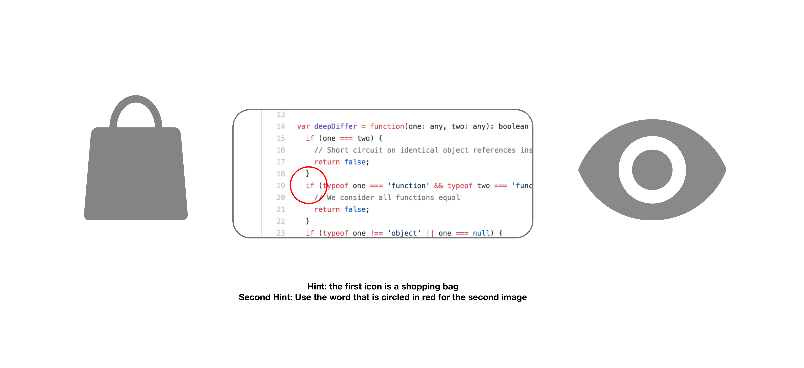

<h4>Introduction </h4>
For a recent class project, I had the opportunity to re-design a company’s core product with the stated goal of increasing revenue by 20%. I paired up with a colleague who shared my interest in helping pandemic winners achieve long-term, sustainable user growth. After exploring user feedback and quantitative usage metrics for a myriad of social apps, we homed in on one compelling and alarming statistic for Pinterest: the company lost 24 million active users in 2021. While this drop in users has not yet impacted their top-line revenue (which is mostly reliant on brand advertising, an industry that is susceptible to seasonality), investors sense trouble ahead and have provided an almost 34% drop in stock price in 2022. 

<h4>Methodology </h4>
To better understand why the drop in active users occurred, we performed user interviews and surveys among individuals who use the app. Overall, we identified two key trends; (1) that users were simply more interested in real-life experiences now that they were no longer confined to their homes, and (2) there was a large gap between male-identifying and female-identifying users—only 15% of Pinterest users identify as male. We came to recognize two key opportunities to grow the app: address our user-retention issue through implementing features that would make the inspiration-based content interface relevant to the post-pandemic user, or tap into a new demographic of addressable users and user needs. While we were drilling down on each opportunity, we found that these two product gaps are not as unrelated as we previously assumed. One key finding we discovered through further interviews and secondary research was that a main reason this demographic does not like Pinterest is that it wasn’t helping them achieve real-life experiences. The lack of product-related information in the core “feed” interface prevented them from using the content to complete an objective. While Pinterest does sometimes link external sources to inspiration-based images, these users wanted a wider variety of information directly on the app to assist them in bringing their inspiration-based content into their lives. Additionally, these users greatly disliked the process of sifting through a wide variety of content to find what they are looking for.

<h4>Solution </h4>
Our solution was to develop a new interface that focused on providing curated content for the specific needs and interests of each user, as well as the information and tools necessary to complete each idea. My partner and I developed and refined three features to assist in this goal: a more comprehensive <a href="https://www.figma.com/file/8s5iaqlg8Gvf3zOchMRZ2T/Shopify?node-id=5%3A2" title="system to filter searches">system to filter searches</a>, a <a href="https://www.figma.com/file/8s5iaqlg8Gvf3zOchMRZ2T/Shopify?node-id=5%3A7" title="start with what you have">"start with what you have"</a> feature that allows users to get inspiration based on what they already own, and <a href="https://www.figma.com/file/8s5iaqlg8Gvf3zOchMRZ2T/Shopify?node-id=6%3A70" title="linked content">linked content</a> directly below each idea that provides more information and tutorials directly related to the filters of the image. Our way of validating this <a href="https://www.figma.com/file/8s5iaqlg8Gvf3zOchMRZ2T/Shopify?node-id=6%3A164" title="final design">final design</a> was to bring it to Home Depot and ask shoppers to try out the prototype in the context of their project. Through this experience we received positive feedback but also a list of new ways to refine our product to fit a wider variety of needs. For example, many users asked for suggested contractors in the local area in addition to DIY tutorials below each image in case they do not have the time to build the project themselves.

<h4>Challenges </h4>
Initially, we were attempting to find new ways to attract a wide range of users from the male-identifying demographic to our app. However, every user has extremely different needs, desires, and interests at different stages of their life, and an inspiration-based content app simply did not realistically fit into the earlier stages of our target user’s life (which was 16-21 year-olds). Attempting to fit our app into the context of these users’ lives caused the main feed interface to lose its core value proposition (which is inspiration-based content curation), leading us to re-evaluate our target demographic and start over early in the process of ideation. If I were to do this project again, I would want to spend more time testing our feature ideas with our target demographic thoroughly before moving forward with the concept. 

<h4>Why Shopify </h4>
I currently own a Shopify store called <a href="https://broccolibuddies.com/" title="Broccoli Buddies">Broccoli Buddies</a>. In this store, I sell mostly clothing that feature my personal illustrations of a character I like to call “Broccoli Buddy”. This store was a passion project born out of a need I recognized among my peers at a recent art fair at RISD–people want illustrated clothing with cute cartoons doing culturally-relevant activities. Taking inspiration from “Ripndip” (a personal favorite alternative clothing brand), I began creating illustrations of an alien wearing sunglasses performing a variety of activities (mostly food-related, as I quickly realized the food-related products were quite popular). I have been thoroughly impressed with my experience using Shopify–the platform is intuitive enough for beginners but also provides many features that allow me to showcase my personal brand in an authentic way. I feel I have enough artistic freedom using the platform to create the digital experience I want my users to have as they shop for my products. I did not feel intimidated by the platform, nor did I feel that I was not tech-savvy enough to use it, which was extremely important as a very small business owner. 

I think my proudest accomplishment has been gaining the opportunity to work with a variety of incredible people. I take away from the experiences on my resume not necessarily any personal achievements but instead a variety of knowledge from these incredibly intelligent individuals who come from a variety of backgrounds with new perspectives to share. 

I don’t know many jokes, but I came up with this one on the spot: 

